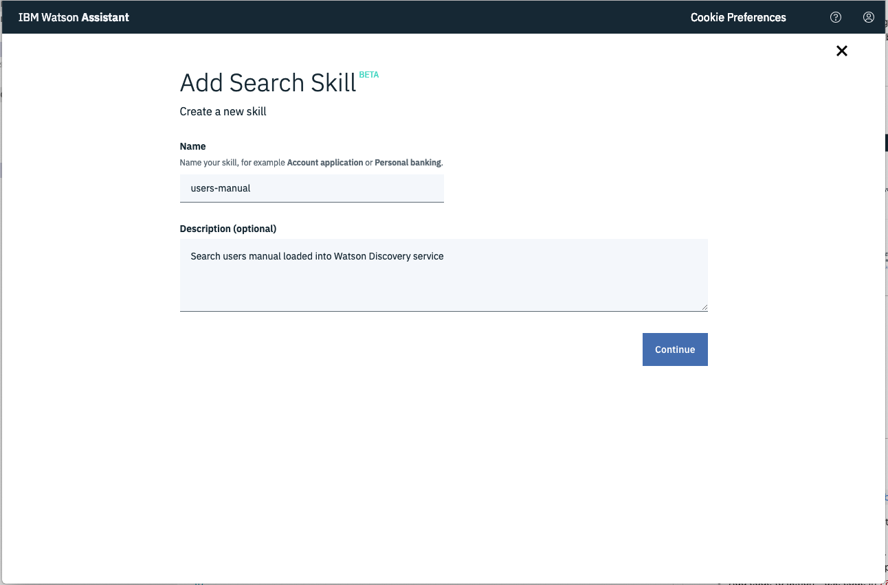
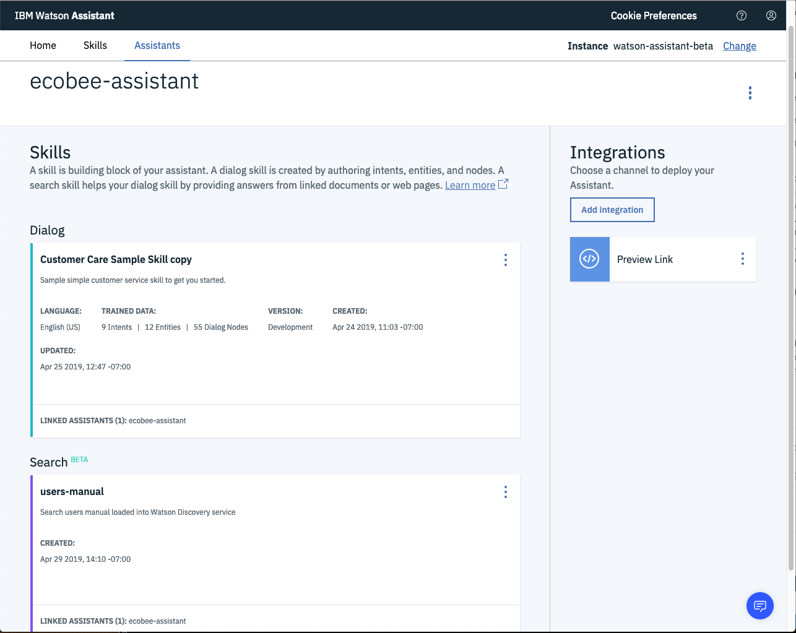
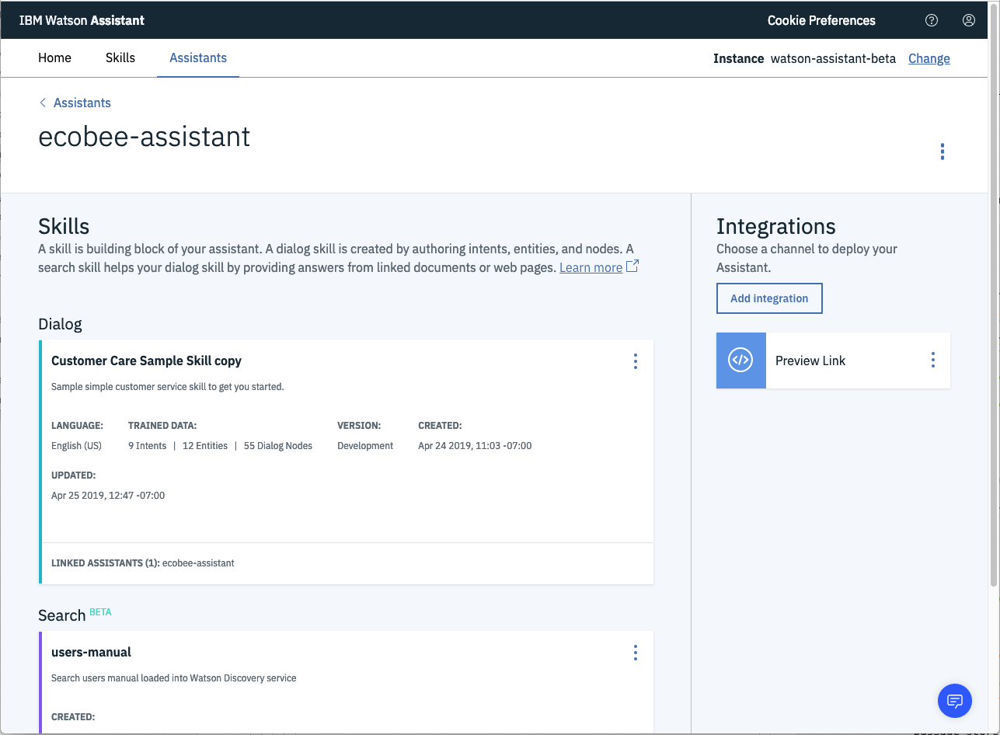
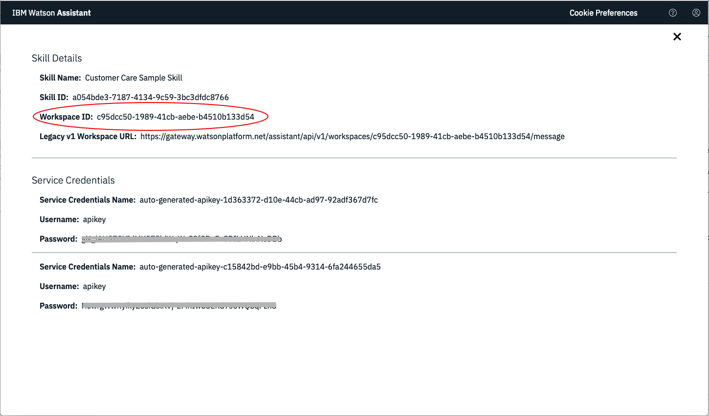

# watson-discovery-sdu-with-assistant

* Use Assistant dialog for better chatbot experience
* Use "customer-care" skill provided by Assistant
* Use Cloud Function to search Disco if question is "anything-else" and reply with disco passages

> Assumes completion of discovery setup described in https://github.com/rhagarty/watson-discovery-sdu-ui.

# TODO:

* Remove code references to calling Disco directly
* Add action creds to .env
* Format Disco results better in chatbot
* Modify search type in Search Skills call to use passages - NOT SUPPORTED

# Notes

* Webhook - beta
* Search Skill - PLUS or PREMIUM PLAN REQUIRED (CURRENTLY BETA)

# Background

There are multiple ways to have Watson Assistant query our Watson Discovery collection:

* Directly invoking a Watson Cloud Functions action
* Using a `webhook` to invoke a Watson Cloud Functions action
* Defining a `Search Skill` to associate with a Watson Discovery collection

All 3 mechanisms are similar in that they are called from a specific Watson Assistant dialog node. The dialog node is then activated during the course of the conversation **IF** the user responds in specific way.

To start, we need to create our dialog which will allow the user to request information from our owner's manual.

To keep this example as easy as possible, we will use the provided `Custom Care Sample Skill` dialog skill that you get for free with the Watson Assistant service. It provides a good basic dialog for interacting with a customer.

But we will need to modify it to handle the case where the user asks an owner's manual type question.

# Create Assistant dialog skill

Click on the `Custom Care Sample Skill` that comes with the Assistant service. You can choose to either duplicate it, or use the original to complete the following steps.

## Add new intent

Create a new intent that can detect when the user is asking an owner's manual question. Name the intent `#Product_Information`.


## Create new dialog node

Select the node labeled `Small Talk` and select the option to `Add node below`:


Label our new Node as `Ask about Product`, and assign our new intent to it.


Now, if the during the course of the conversation the user asks a question such as "how do I set the time?", Assistant will recognize this as a request for product information and will activate this node. The result of this should be a request to our Discovery collection. How this is accomplished depends on which of the 3 integration methods you choose.

**Choose one of the following integration methods for further instructions:**

1. [Direct call to Cloud Functions action](#direct-call-to-cloud-functions-action)
1. [Webhook call to Cloud Functions action](#webhook-call-to-cloud-functions-action)
1. [Search Skill](#search-skill)

# Direct call to Cloud Functions action

## Create a Cloud Functions action

Go to [How to create a Cloud Functions action](#how-to-create-a-cloud-functions-action) for instructions on how to create your action.

## Modify dialog node to call Cloud Functions action

In the response section of our newly created dialog node, click on `Open JSON Editor`, and enter the following code snippet:


The code snippet is:

```javascript
{
  "output": {
    "generic": [
      {
        "values": [
          {
            "text": "Here is some info I found in the manual:"
          }
        ],
        "response_type": "text",
        "selection_policy": "sequential"
      }
    ]
  },
  "actions": [
    {
      "name": "/IBM Cloud Storage_dev/actions/disco-action",
      "type": "server",
      "parameters": {
        "input": "<?input.text?>"
      },
      "credentials": "$my_creds",
      "result_variable": "context.discovery_output"
    }
  ]
}
```

* Note the action `name` value of `/IBM Cloud Storage_dev/actions/disco-action`. This is derived from your endpoint name listed in the `Cloud Functions` action panel:

```https://us-south.functions.cloud.ibm.com/api/v1/namespaces/IBM%20Cloud%20Storage_dev/actions/disco-action```

Remove the host path, and translate encoded chars to ASCII (i.e. `%20` to a blank char).

* Using the `Try it` feature, add the context variable `my_creds` and see if it works (probably won't return anything meaningful in the test window, but you should NOT get an error due to credentials).

> Note: You must enter a response to trigger the assistant dialog node that calls the action.


The format of the credentials should be the following:

```json
{"user":"7a4d1a77-2429-xxxx-xxxx-a2b438e15bea","password":"RVVEdpPFLAuuTwFXjjKujPKY0hUOEztxxxxxxxxxonHeF7OdAm77Uc34GL2wQHDx"}
```

These values are pulled from the `Functions` action panel, click on `API-KEY` which then takes you to the `API Key` panel, where the key is found:

```bash
7a4d1a77-2429-xxxx-xxxx-a2b438e15bea:RVVEdpPFLAuuTwFXjjKujPKY0hUOEztxxxxxxxxxonHeF7OdAm77Uc34GL2wQHDx
```

> Note: the value before the `:` is the user, and everthing after is the password. Do not include the `:` in either value.

## Notes about action type

When you define the programmatic call, you choose one of the following types:

* **server:**

* **client:** Defines a programmatic call in a standardized format that your external client application can understand. Your client application must use the provided information to run the programmatic call or function, and return the result to the dialog. This type of call basically tells the dialog to pause here and wait for the client application to go do something. The program that the client application runs can be anything that you choose. Be sure to specify the call name and parameter details, and the error message variable name, according to the JSON formatting rules that are outlined later.

* **cloud_function:** Calls an Cloud Functions action directly, and returns the result to the dialog. You must provide a Cloud Functions authentication key with the call. (This type used to be named server. The type server continues to be supported.)

* **web_action:** Calls a Cloud Functions web action. Web actions are annotated Cloud Functions actions that developers can use to program backend logic that a web application can access anonymously, without requiring a Cloud Functions authentication key. Although authentication isn't required, web actions can be secured in the following ways:

  * With an authentication token that is specific to the web action, and can be revoked or changed by the action owner at any time
  * By passing your Cloud Functions credentials

## Add Cloud Function creds to application

* The Cloud Function credentials need to be assigned to the Assistant context variable name `my_creds`, and passed in from your application to the Watson Assisant API.

```javascript
    context.my_creds = {
      'user':'7a4d1a77-2429-xxxx-xxxx-a2b438e15bea',
      'password':'RVVEdpPFLAuuTwFXjjKujPKY0hUOEztxxxxxxxxxF7OdAm77Uc34GL2wQHDx'
    };
```

# Webhook call to Cloud Functions action

## Create a Cloud Functions action

Go to [How to create a Cloud Functions action](#how-to-create-a-cloud-functions-action) for instructions on how to create your action.

## Enable webhook from Assistant

* Set up access to WebHook for the our Custom Care skill:


* In the cell you want to trigger action, click on `Customize`, and enable Webhooks for this node:


* Then you can add params, change name of return variable, etc.


## Test in Assistant Tooling

* Using the `Try it` feature, add the context variable `my_creds` and see if it works (probably won't return anything meaningful in the test window, but you should NOT get an error due to credentials).

> Note: You must enter a response to trigger the assistant dialog node that calls the action.


{"user":"7a4d1a77-2429-xxxx-xxxx-a2b438e15bea","password":"RVVEdpPFLAuuTwFXjjKujPKY0hUOEztxxxxxxxxxonHeF7OdAm77Uc34GL2wQHDx"}

These values are pulled from the `Functions` action panel, click on `API-KEY` which then takes you to the `API Key` panel, where the key is found:

```bash
7a4d1a77-2429-xxxx-xxxx-a2b438e15bea:RVVEdpPFLAuuTwFXjjKujPKY0hUOEztxxxxxxxxxonHeF7OdAm77Uc34GL2wQHDx
```

> Note: the value before the `:` is the user, and after is the password. Do not include the `:` in either value.

# Search Skill

## Create Search Skill

Start creation process:


Name your skill:



Attach to Discovery instance and collection:


Configure how the search will respond:


## Invoke the Search Skill from dialog node

Modify the "Ask about product" dialog node to call out to the search skill:


How to use the `Query` option: https://cloud.ibm.com/docs/services/assistant?topic=assistant-dialog-overview#dialog-overview-multimedia

## Create Assistant instance to combine dialog and search skills:

In order to use both skills, you need to create an `Assistant` object that integrates them.



## Test in Assistant Tooling

From the `Assistant` panel, press the `Preview Link` button:



Then press the `Preview` URL:


Then use the chatbot to test accessing the search skill:


# Configure credentials

```bash
cp env.sample .env
```

Copy the `env.sample` file and rename it `.env` and update the `<***>` tags with the credentials from your Assistant service.

#### `env.sample:`

```bash
# Copy this file to .env and replace the credentials with
# your own before starting the app.

# Watson Discovery
ASSISTANT_WORKSPACE_ID=<add_assistant_workspace_id>
ASSISTANT_IAM_APIKEY=<add_assistant_iam_apikey>

# Run locally on a non-default port (default is 3000)
# PORT=3000
```

Credentials can be found by clicking the Service Credentials tab, then the View Credentials option from the panel of your created Watson service.

An additional `WORKSPACE_ID` value is required to access the Watson Assistant service. To get this value, select the `Manage` tab, then the `Launch tool` button from the panel of your Watson Assistance service. From the service instance panel, select the `Skills` tab to display the skills that exist for your service. For this tutorial, we will be using the `Custom Skill Sample Skill` that comes with the service:

<p align="center">
  
</p>

Click the option button (highlighted in the image above) to view all of your skill details and service credentials:



# Run locally

```bash
npm install
npm start
```

Access the UI by pointing your browser at `localhost:3000`.

Sample questions:

* **how do I set a schedule?**
* **how do I set the temperature?**
* **how do I set the time?**

# Sample Output


# Additional Instructions

## How to create a Cloud Functions action

* From IBM Cloud resource list, create `New` and select `Functions`.
* Click on `Actions` tab.
* `Create` and then `Create Action`.
* Provide unique `Action Name`, keep default package, and select `Node.js 10` runtime.
* Add code to action - use code in `/actions/disco-action.js`.


* Note your endpoint:


* Test the action by executing the `curl` command shown at the bottom of the panel.
